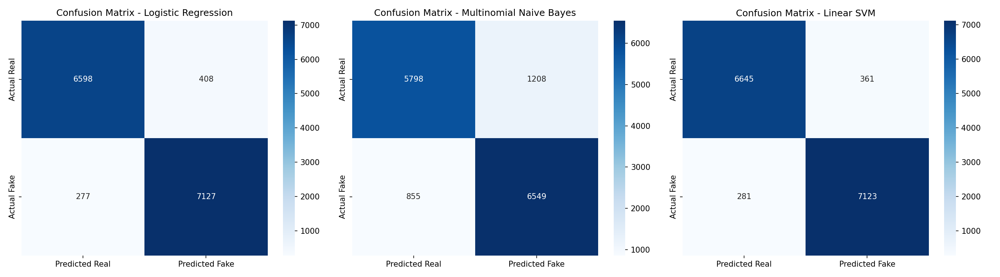

# 🔍 Fake News Detector

An end-to-end fake news detection system combining NLP, Machine Learning,
and Generative AI — trained on 72,134 real-world news articles.

🚀 **[Live Demo](https://fake-news-detector-lx6xras373wxp86nkram4p.streamlit.app/)**

---

## Overview

This project classifies news articles as Fake or Real using a TF-IDF +
Logistic Regression pipeline, then uses Google Gemini to generate a plain-
language explanation of the prediction. Three models are compared directly
in the application — Logistic Regression, Multinomial Naive Bayes, and
Linear SVM — so predictions can be evaluated side by side on any input.

An educational article generator demonstrates the linguistic differences
between fake and credible journalism.

---

## Screenshots

### Prediction Result


### AI Explanation


### Article Generation


### Model Comparison — Confusion Matrices


---

## Model Performance

Trained and evaluated on the WELFake dataset (72,134 articles, 80/20 split).

| Model | Accuracy | Precision | Recall | F1 Score |
|---|---|---|---|---|
| Logistic Regression | 95.25% | 94.59% | 96.26% | 95.41% |
| Multinomial Naive Bayes | 85.68% | 84.43% | 88.45% | 86.39% |
| Linear SVM | 95.54% | 95.18% | 96.20% | 95.69% |

**Primary model: Logistic Regression.**
LR and SVM perform within 0.03% of each other on accuracy and F1.
LR is selected as the primary model because its coefficients are directly
inspectable — the contribution of each token to a prediction can be
extracted and analyzed. SVM's decision boundary does not offer this
transparency. For a marginal accuracy difference, interpretability wins.
MNB underperforms by approximately 10 points across all metrics and misses
roughly 856 fake articles in the test set compared to LR's 277 — a
meaningful gap for a misinformation detection use case.

---

## How It Works

```
User Input → Text Cleaning → TF-IDF Vectorization → Three Model Predictions
→ Confidence Scores → Gemini Explanation (LR) → Streamlit UI
```

1. Raw article text is cleaned: lowercased, URLs and mentions removed,
   stopwords filtered, non-alphabetic characters stripped.
2. TF-IDF converts cleaned text into a 5,000-feature sparse matrix
   using unigrams and bigrams.
3. All three models predict simultaneously. Results are displayed side
   by side for direct comparison.
4. Google Gemini generates a 3–4 paragraph educational explanation
   based on the Logistic Regression prediction — togglable to conserve
   API quota.

---

## Tech Stack

| Component | Technology |
|---|---|
| Language | Python 3.10+ |
| ML | scikit-learn (LR, MNB, LinearSVC) |
| NLP | NLTK, TF-IDF |
| Generative AI | Google Gemini 2.5 Flash |
| Interface | Streamlit |
| Data | Pandas |

---

## Dataset

**WELFake Dataset** — 72,134 articles (51% fake, 49% real) sourced from
Kaggle, Reuters, BuzzFeed Political, and McIntire.

Not included in this repository due to size.
[Download from Kaggle](https://www.kaggle.com/datasets/saurabhshahane/fake-news-classification)

---

## Setup

```bash
git clone https://github.com/vansharora200-max/fake-news-detector.git
cd fake-news-detector
pip install -r requirements.txt
echo "GEMINI_API_KEY=your_key_here" > .env
streamlit run app.py
```

To retrain all three models from scratch:
```bash
python train.py
```

---

## Design Decisions

**Why WELFake?**
An initial synthetic dataset was rejected after manual row inspection
revealed artificial word sequences. WELFake contains genuine scraped
articles and better represents real-world inputs.

**Why TF-IDF over embeddings?**
TF-IDF is interpretable, fast to train, and well-suited to high-dimensional
sparse text classification. Bigrams partially compensate for lack of word
order. Logistic regression coefficients remain directly inspectable —
a property that was essential for identifying the shortcut learning
finding described below.

**Why compare three models?**
A single model only shows its own behavior. Comparing LR, MNB, and SVM
on identical inputs reveals how different algorithms respond to the same
feature space — including cases where they disagree. Disagreements are
often more informative than agreements.

**Why Logistic Regression as primary?**
Produces calibrated probability scores, trains quickly, and its
coefficients are directly interpretable. For a 0.03% accuracy difference
over SVM, interpretability is the deciding factor.

---

## Limitations & Key Findings

**Shortcut learning (source leakage)**
Coefficient analysis shows the model's strongest real-news indicators
are source attribution tokens: `reuters`, `washington reuters`,
`york times`. The model learned to associate wire service bylines with
credibility rather than linguistic features of the article itself.

Adversarial probe confirming this:
> *"Reuters reported that the moon is made of cheese. Washington Reuters
> confirms that drinking bleach cures cancer."*
> **Classified: 100% Real — all three models**

**Distribution mismatch**
LLM-generated real-style articles consistently classify as Fake across
all three models. The models were trained on 2015-2018 era news with
specific vocabulary patterns. Gemini-generated text produces different
token distributions and lacks the wire service bylines the models
associate with real news.

**Negation loss**
Stopword removal eliminates words like "not", altering semantic meaning
in edge cases. Context-aware models such as BERT would handle this
differently at the cost of interpretability and training speed.

**What this means**
This system is reliable for WELFake-style content and genuine wire
service journalism. It should not be used as a general-purpose fake
news detector without retraining on a source-neutral dataset.

---

## Project Structure

```
├── app.py                  # Streamlit application
├── predict.py              # ML prediction pipeline (all three models)
├── genai.py                # Gemini explanation and article generation
├── train.py                # Model training pipeline
├── utils.py                # Shared text cleaning
├── models/                 # Saved vectorizer and classifiers (.pkl)
├── notebooks/              # EDA, preprocessing, feature engineering,
│                           # model training, three-model comparison
├── screenshots/
├── requirements.txt
└── README.md
```